# MOMENTUM Paper Diagrams (Mermaid)

This file contains all Mermaid diagram equivalents for the MOMENTUM NeurIPS 2025 paper.

---

## Figure 1: MOMENTUM Physics Metaphor

The core equation: **Momentum = Context × Model** (p = m × v)


```mermaid
flowchart LR
    subgraph Mass["<b>MASS (m)</b><br/>Context"]
        BS[Brand Soul]
        UM[User Memory]
        TI[Team Intelligence]
        II[Individual Identity]
        SC[Settings Context]
        MC[Media Context]
    end

    subgraph Velocity["<b>VELOCITY (v)</b><br/>Model Capabilities"]
        G[Gemini<br/>2.0/2.5/3.0]
        I[Imagen 4.0]
        V[Veo 3.1]
        NB[Nano Banana]
    end

    subgraph Momentum["<b>MOMENTUM (p)</b><br/>Unstoppable Execution"]
        TG[Text Generation]
        IG[Image Generation]
        VG[Video Generation]
        WS[Web Search]
        ML[Media Library]
        DU[Doc Understanding]
    end

    Mass -->|"×"| Velocity
    Velocity -->|"="| Momentum

    style Mass fill:#e3f2fd,stroke:#1976d2,stroke-width:2px
    style Velocity fill:#fff3e0,stroke:#f57c00,stroke-width:2px
    style Momentum fill:#e8f5e9,stroke:#388e3c,stroke-width:2px
```

### Alternative: Conceptual Illustration

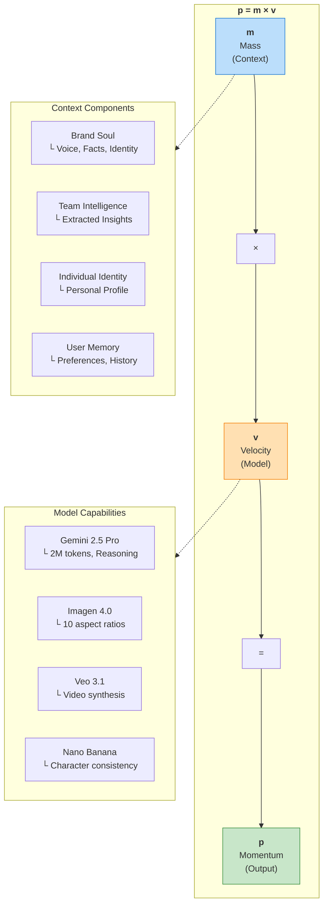
```mermaid
graph TB
    subgraph Equation["<b>p = m × v</b>"]
        direction LR
        M["<b>m</b><br/>Mass<br/>(Context)"]
        TIMES["×"]
        VEL["<b>v</b><br/>Velocity<br/>(Model)"]
        EQUALS["="]
        P["<b>p</b><br/>Momentum<br/>(Output)"]
    end

    M --> TIMES --> VEL --> EQUALS --> P

    subgraph ContextDetails["Context Components"]
        C1["Brand Soul<br/>└ Voice, Facts, Identity"]
        C2["Team Intelligence<br/>└ Extracted Insights"]
        C3["Individual Identity<br/>└ Personal Profile"]
        C4["User Memory<br/>└ Preferences, History"]
    end

    subgraph ModelDetails["Model Capabilities"]
        M1["Gemini 2.5 Pro<br/>└ 2M tokens, Reasoning"]
        M2["Imagen 4.0<br/>└ 10 aspect ratios"]
        M3["Veo 3.1<br/>└ Video synthesis"]
        M4["Nano Banana<br/>└ Character consistency"]
    end

    M -.-> ContextDetails
    VEL -.-> ModelDetails

    style M fill:#bbdefb,stroke:#1976d2
    style VEL fill:#ffe0b2,stroke:#f57c00
    style P fill:#c8e6c9,stroke:#388e3c
```

---

## Figure 2: Four-Layer Architecture Diagram

MOMENTUM's four-layer architecture showing context flow from presentation through persistence.

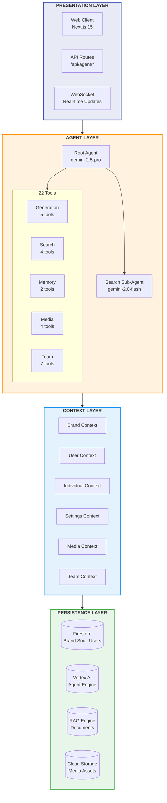
```mermaid
flowchart TB
    subgraph Presentation["<b>PRESENTATION LAYER</b>"]
        direction LR
        WEB[Web Client<br/>Next.js 15]
        API[API Routes<br/>/api/agent/*]
        WS[WebSocket<br/>Real-time Updates]
    end

    subgraph Agent["<b>AGENT LAYER</b>"]
        direction TB
        RA[Root Agent<br/>gemini-2.5-pro]

        subgraph Tools["22 Tools"]
            direction LR
            GEN[Generation<br/>5 tools]
            SRCH[Search<br/>4 tools]
            MEM[Memory<br/>2 tools]
            MEDIA[Media<br/>4 tools]
            TEAM[Team<br/>7 tools]
        end

        SA[Search Sub-Agent<br/>gemini-2.0-flash]
    end

    subgraph Context["<b>CONTEXT LAYER</b>"]
        direction LR
        BC[Brand Context]
        UC[User Context]
        IC[Individual Context]
        SC[Settings Context]
        MC[Media Context]
        TC[Team Context]
    end

    subgraph Persistence["<b>PERSISTENCE LAYER</b>"]
        direction LR
        FS[(Firestore<br/>Brand Soul, Users)]
        VAE[(Vertex AI<br/>Agent Engine)]
        RAG[(RAG Engine<br/>Documents)]
        GCS[(Cloud Storage<br/>Media Assets)]
    end

    Presentation --> Agent
    Agent --> Context
    Context --> Persistence

    RA --> Tools
    RA --> SA

    style Presentation fill:#e8eaf6,stroke:#3f51b5,stroke-width:2px
    style Agent fill:#fff3e0,stroke:#ff9800,stroke-width:2px
    style Context fill:#e3f2fd,stroke:#2196f3,stroke-width:2px
    style Persistence fill:#e8f5e9,stroke:#4caf50,stroke-width:2px
```

### Detailed Tool Breakdown

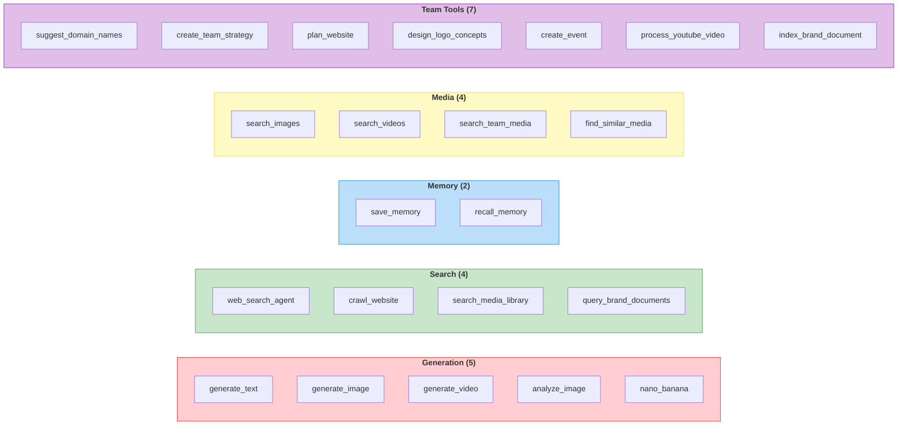
```mermaid
flowchart LR
    subgraph Generation["<b>Generation (5)</b>"]
        GT[generate_text]
        GI[generate_image]
        GV[generate_video]
        AI[analyze_image]
        NB[nano_banana]
    end

    subgraph Search["<b>Search (4)</b>"]
        WSA[web_search_agent]
        CW[crawl_website]
        SML[search_media_library]
        QBD[query_brand_documents]
    end

    subgraph Memory["<b>Memory (2)</b>"]
        SM[save_memory]
        RM[recall_memory]
    end

    subgraph Media["<b>Media (4)</b>"]
        SI[search_images]
        SV[search_videos]
        STM[search_team_media]
        FSM[find_similar_media]
    end

    subgraph Team["<b>Team Tools (7)</b>"]
        SDN[suggest_domain_names]
        CTS[create_team_strategy]
        PW[plan_website]
        DLC[design_logo_concepts]
        CE[create_event]
        PYV[process_youtube_video]
        IBD[index_brand_document]
    end

    style Generation fill:#ffcdd2,stroke:#e53935
    style Search fill:#c8e6c9,stroke:#43a047
    style Memory fill:#bbdefb,stroke:#1e88e5
    style Media fill:#fff9c4,stroke:#fdd835
    style Team fill:#e1bee7,stroke:#8e24aa
```

---

## Figure 3: Context Flow Sankey Diagram

Context flows through the system like momentum, accumulating rather than dissipating at each transition.

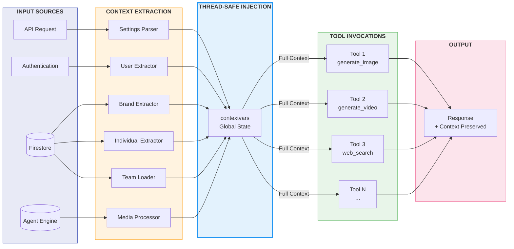
```mermaid
flowchart LR
    subgraph Input["<b>INPUT SOURCES</b>"]
        REQ[API Request]
        AUTH[Authentication]
        DB[(Firestore)]
        AE[(Agent Engine)]
    end

    subgraph Extraction["<b>CONTEXT EXTRACTION</b>"]
        BE[Brand Extractor]
        UE[User Extractor]
        IE[Individual Extractor]
        SE[Settings Parser]
        ME[Media Processor]
        TE[Team Loader]
    end

    subgraph Injection["<b>THREAD-SAFE INJECTION</b>"]
        CV[contextvars<br/>Global State]
    end

    subgraph Tools["<b>TOOL INVOCATIONS</b>"]
        T1[Tool 1<br/>generate_image]
        T2[Tool 2<br/>generate_video]
        T3[Tool 3<br/>web_search]
        TN[Tool N<br/>...]
    end

    subgraph Output["<b>OUTPUT</b>"]
        RES[Response<br/>+ Context Preserved]
    end

    REQ --> SE
    AUTH --> UE
    DB --> BE
    DB --> IE
    DB --> TE
    AE --> ME

    BE --> CV
    UE --> CV
    IE --> CV
    SE --> CV
    ME --> CV
    TE --> CV

    CV -->|"Full Context"| T1
    CV -->|"Full Context"| T2
    CV -->|"Full Context"| T3
    CV -->|"Full Context"| TN

    T1 --> RES
    T2 --> RES
    T3 --> RES
    TN --> RES

    style Input fill:#e8eaf6,stroke:#3f51b5
    style Extraction fill:#fff3e0,stroke:#ff9800
    style Injection fill:#e3f2fd,stroke:#2196f3,stroke-width:3px
    style Tools fill:#e8f5e9,stroke:#4caf50
    style Output fill:#fce4ec,stroke:#e91e63
```

### Context Layer Hierarchy

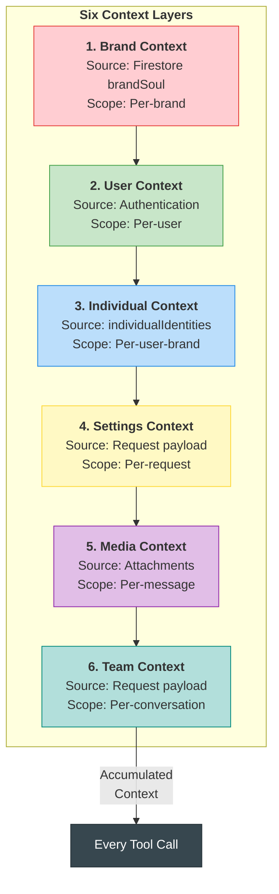
```mermaid
graph TD
    subgraph Layers["<b>Six Context Layers</b>"]
        L1["<b>1. Brand Context</b><br/>Source: Firestore brandSoul<br/>Scope: Per-brand"]
        L2["<b>2. User Context</b><br/>Source: Authentication<br/>Scope: Per-user"]
        L3["<b>3. Individual Context</b><br/>Source: individualIdentities<br/>Scope: Per-user-brand"]
        L4["<b>4. Settings Context</b><br/>Source: Request payload<br/>Scope: Per-request"]
        L5["<b>5. Media Context</b><br/>Source: Attachments<br/>Scope: Per-message"]
        L6["<b>6. Team Context</b><br/>Source: Request payload<br/>Scope: Per-conversation"]
    end

    L1 --> L2 --> L3 --> L4 --> L5 --> L6

    L6 -->|"Accumulated<br/>Context"| TOOL[Every Tool Call]

    style L1 fill:#ffcdd2,stroke:#e53935
    style L2 fill:#c8e6c9,stroke:#43a047
    style L3 fill:#bbdefb,stroke:#1e88e5
    style L4 fill:#fff9c4,stroke:#fdd835
    style L5 fill:#e1bee7,stroke:#8e24aa
    style L6 fill:#b2dfdb,stroke:#00897b
    style TOOL fill:#37474f,stroke:#263238,color:#fff
```

---

## Figure 4: Brand Soul Pipeline (Team Intelligence)

The Team Intelligence pipeline distills organizational knowledge into concentrated Brand Soul.

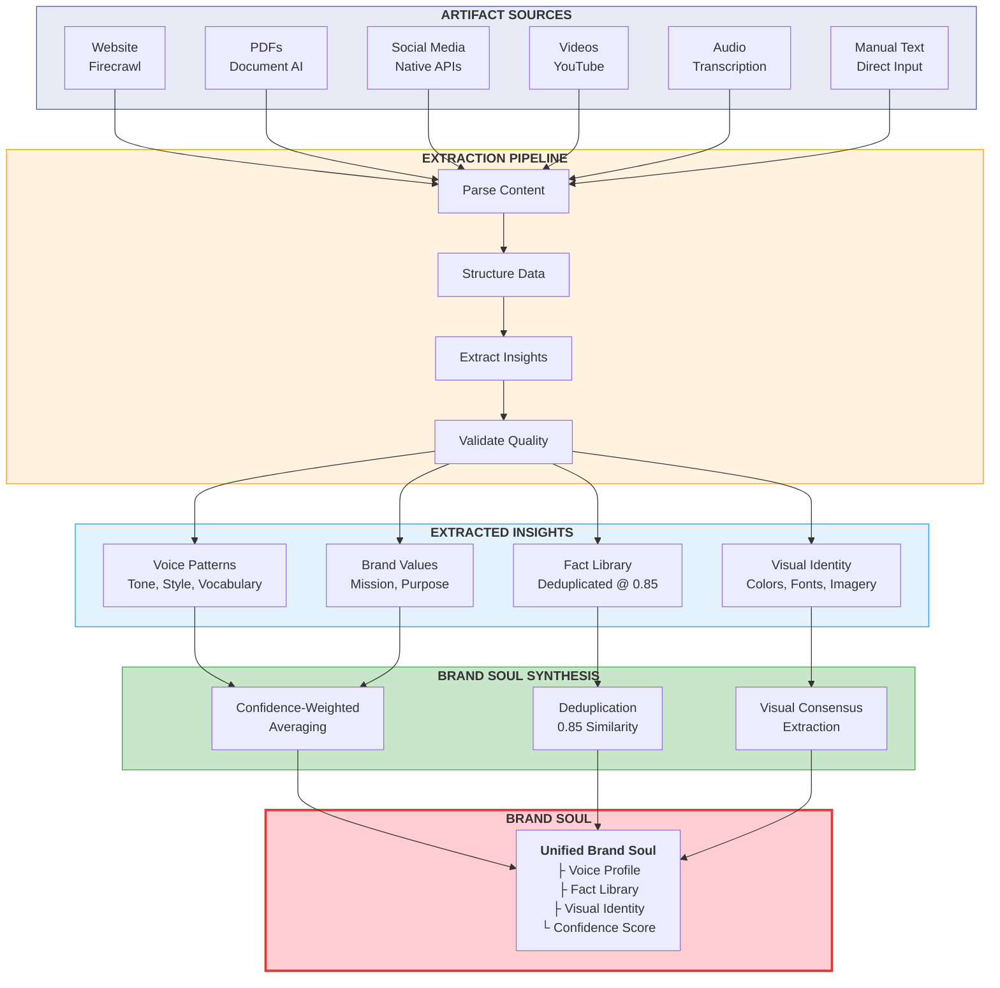
```mermaid
flowchart TB
    subgraph Sources["<b>ARTIFACT SOURCES</b>"]
        WEB[Website<br/>Firecrawl]
        PDF[PDFs<br/>Document AI]
        SOC[Social Media<br/>Native APIs]
        VID[Videos<br/>YouTube]
        AUD[Audio<br/>Transcription]
        MAN[Manual Text<br/>Direct Input]
    end

    subgraph Processing["<b>EXTRACTION PIPELINE</b>"]
        direction TB
        PARSE[Parse Content]
        STRUCT[Structure Data]
        EXTRACT[Extract Insights]
        VALIDATE[Validate Quality]
    end

    subgraph Insights["<b>EXTRACTED INSIGHTS</b>"]
        VOICE[Voice Patterns<br/>Tone, Style, Vocabulary]
        FACTS[Fact Library<br/>Deduplicated @ 0.85]
        VISUAL[Visual Identity<br/>Colors, Fonts, Imagery]
        VALUES[Brand Values<br/>Mission, Purpose]
    end

    subgraph Synthesis["<b>BRAND SOUL SYNTHESIS</b>"]
        MERGE[Confidence-Weighted<br/>Averaging]
        DEDUP[Deduplication<br/>0.85 Similarity]
        CONSENSUS[Visual Consensus<br/>Extraction]
    end

    subgraph Output["<b>BRAND SOUL</b>"]
        BS["<b>Unified Brand Soul</b><br/>├ Voice Profile<br/>├ Fact Library<br/>├ Visual Identity<br/>└ Confidence Score"]
    end

    WEB --> PARSE
    PDF --> PARSE
    SOC --> PARSE
    VID --> PARSE
    AUD --> PARSE
    MAN --> PARSE

    PARSE --> STRUCT --> EXTRACT --> VALIDATE

    VALIDATE --> VOICE
    VALIDATE --> FACTS
    VALIDATE --> VISUAL
    VALIDATE --> VALUES

    VOICE --> MERGE
    FACTS --> DEDUP
    VISUAL --> CONSENSUS
    VALUES --> MERGE

    MERGE --> BS
    DEDUP --> BS
    CONSENSUS --> BS

    style Sources fill:#e8eaf6,stroke:#3f51b5
    style Processing fill:#fff3e0,stroke:#ff9800
    style Insights fill:#e3f2fd,stroke:#2196f3
    style Synthesis fill:#c8e6c9,stroke:#43a047
    style Output fill:#ffcdd2,stroke:#e53935,stroke-width:3px
```

---

## Figure 5: Individual Identity Pipeline (NEW)

Individual Identity context blending for personalized generation.

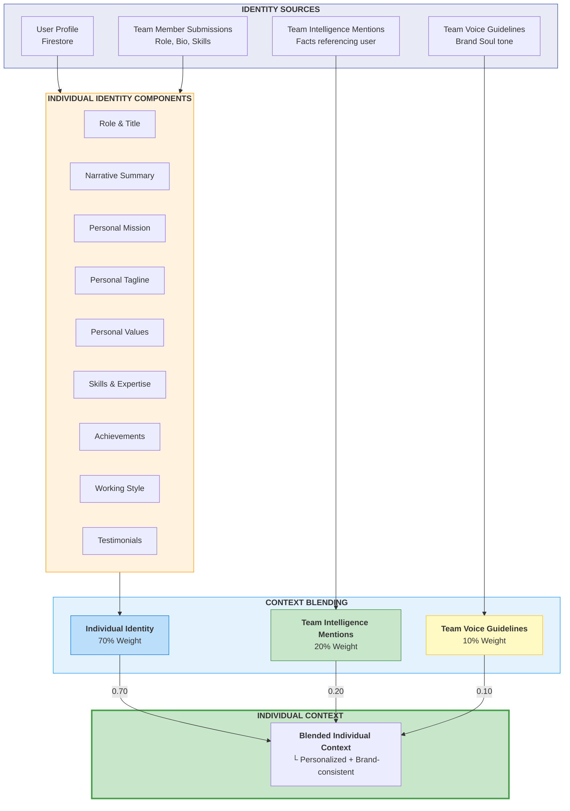
```mermaid
flowchart TB
    subgraph Sources["<b>IDENTITY SOURCES</b>"]
        UP[User Profile<br/>Firestore]
        TS[Team Member Submissions<br/>Role, Bio, Skills]
        TM[Team Intelligence Mentions<br/>Facts referencing user]
        TV[Team Voice Guidelines<br/>Brand Soul tone]
    end

    subgraph Components["<b>INDIVIDUAL IDENTITY COMPONENTS</b>"]
        direction LR
        ROLE[Role & Title]
        NARR[Narrative Summary]
        MISS[Personal Mission]
        TAG[Personal Tagline]
        VAL[Personal Values]
        SKL[Skills & Expertise]
        ACH[Achievements]
        WS[Working Style]
        TEST[Testimonials]
    end

    subgraph Blending["<b>CONTEXT BLENDING</b>"]
        direction TB
        II["<b>Individual Identity</b><br/>70% Weight"]
        TIM["<b>Team Intelligence Mentions</b><br/>20% Weight"]
        TVG["<b>Team Voice Guidelines</b><br/>10% Weight"]
    end

    subgraph Output["<b>INDIVIDUAL CONTEXT</b>"]
        IC["<b>Blended Individual Context</b><br/>└ Personalized + Brand-consistent"]
    end

    UP --> Components
    TS --> Components

    Components --> II
    TM --> TIM
    TV --> TVG

    II -->|"0.70"| IC
    TIM -->|"0.20"| IC
    TVG -->|"0.10"| IC

    style Sources fill:#e8eaf6,stroke:#3f51b5
    style Components fill:#fff3e0,stroke:#ff9800
    style Blending fill:#e3f2fd,stroke:#2196f3
    style Output fill:#c8e6c9,stroke:#43a047,stroke-width:3px
    style II fill:#bbdefb,stroke:#1976d2
    style TIM fill:#c8e6c9,stroke:#388e3c
    style TVG fill:#fff9c4,stroke:#fbc02d
```

### Individual Identity Data Model

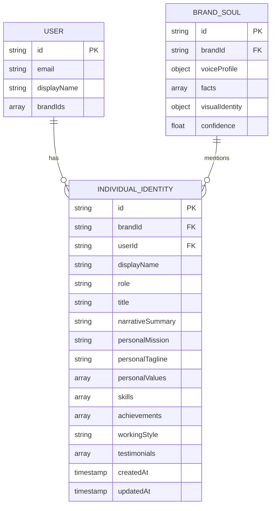
```mermaid
erDiagram
    INDIVIDUAL_IDENTITY {
        string id PK
        string brandId FK
        string userId FK
        string displayName
        string role
        string title
        string narrativeSummary
        string personalMission
        string personalTagline
        array personalValues
        array skills
        array achievements
        string workingStyle
        array testimonials
        timestamp createdAt
        timestamp updatedAt
    }

    BRAND_SOUL {
        string id PK
        string brandId FK
        object voiceProfile
        array facts
        object visualIdentity
        float confidence
    }

    USER {
        string id PK
        string email
        string displayName
        array brandIds
    }

    USER ||--o{ INDIVIDUAL_IDENTITY : "has"
    BRAND_SOUL ||--o{ INDIVIDUAL_IDENTITY : "mentions"
```

---

## Figure 6: Visibility Workflow (NEW)

Visibility approval workflow for Team Intelligence artifacts.

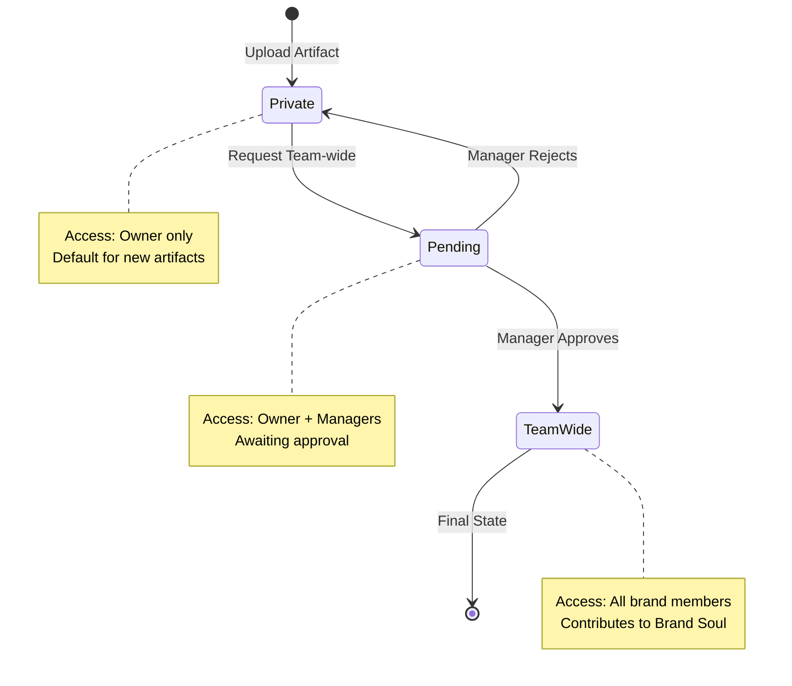
```mermaid
stateDiagram-v2
    [*] --> Private: Upload Artifact

    Private --> Pending: Request Team-wide
    Pending --> TeamWide: Manager Approves
    Pending --> Private: Manager Rejects

    TeamWide --> [*]: Final State

    note right of Private
        Access: Owner only
        Default for new artifacts
    end note

    note right of Pending
        Access: Owner + Managers
        Awaiting approval
    end note

    note right of TeamWide
        Access: All brand members
        Contributes to Brand Soul
    end note
```

### Detailed Approval Workflow

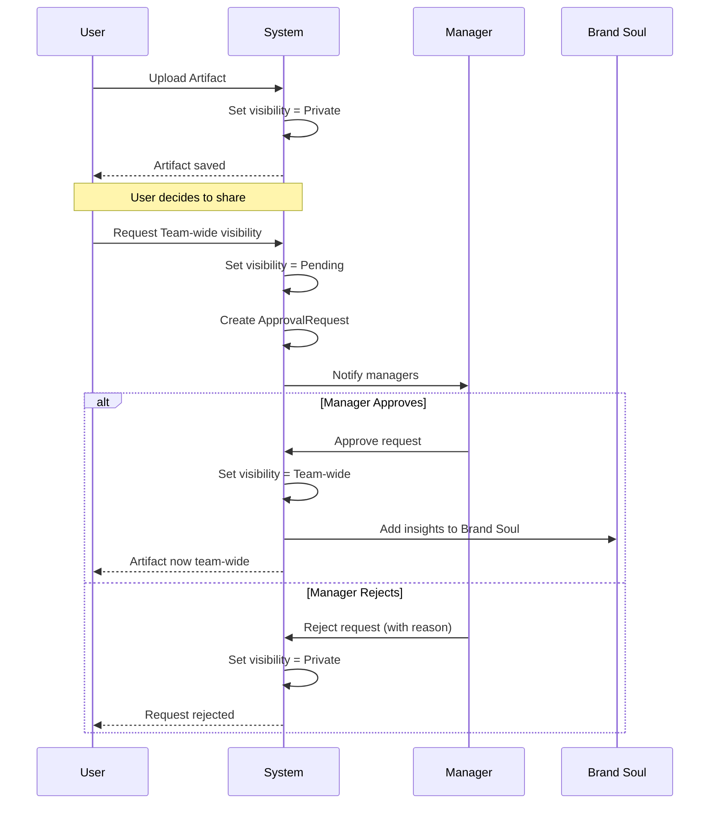
```mermaid
sequenceDiagram
    participant U as User
    participant S as System
    participant M as Manager
    participant BS as Brand Soul

    U->>S: Upload Artifact
    S->>S: Set visibility = Private
    S-->>U: Artifact saved

    Note over U,S: User decides to share

    U->>S: Request Team-wide visibility
    S->>S: Set visibility = Pending
    S->>S: Create ApprovalRequest
    S->>M: Notify managers

    alt Manager Approves
        M->>S: Approve request
        S->>S: Set visibility = Team-wide
        S->>BS: Add insights to Brand Soul
        S-->>U: Artifact now team-wide
    else Manager Rejects
        M->>S: Reject request (with reason)
        S->>S: Set visibility = Private
        S-->>U: Request rejected
    end
```

### Visibility State Machine

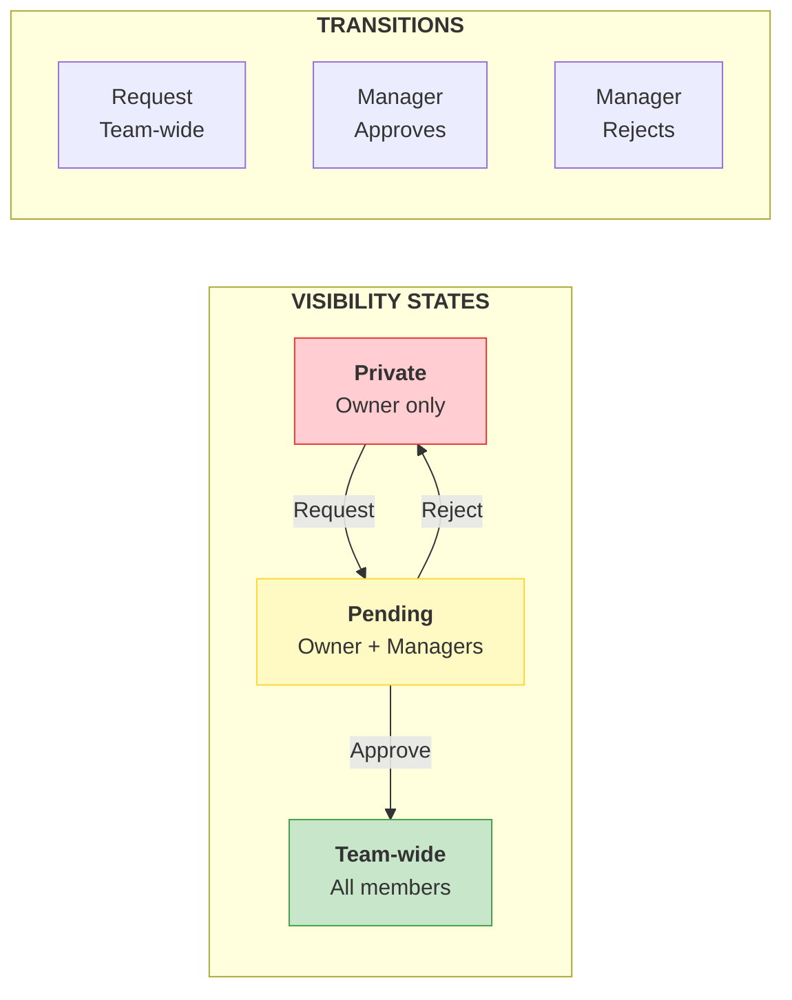
```mermaid
flowchart LR
    subgraph States["<b>VISIBILITY STATES</b>"]
        PRIV["<b>Private</b><br/>Owner only"]
        PEND["<b>Pending</b><br/>Owner + Managers"]
        TEAM["<b>Team-wide</b><br/>All members"]
    end

    subgraph Actions["<b>TRANSITIONS</b>"]
        REQ[Request<br/>Team-wide]
        APP[Manager<br/>Approves]
        REJ[Manager<br/>Rejects]
    end

    PRIV -->|"Request"| PEND
    PEND -->|"Approve"| TEAM
    PEND -->|"Reject"| PRIV

    style PRIV fill:#ffcdd2,stroke:#e53935
    style PEND fill:#fff9c4,stroke:#fdd835
    style TEAM fill:#c8e6c9,stroke:#43a047
```

---

## Figure 7: Dual-Scope Memory Architecture

Team Memory Banks and Personal Memory Banks with source tracking.

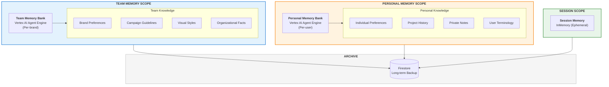
```mermaid
flowchart TB
    subgraph TeamScope["<b>TEAM MEMORY SCOPE</b>"]
        TMB["<b>Team Memory Bank</b><br/>Vertex AI Agent Engine<br/>(Per-brand)"]

        subgraph TeamContents["Team Knowledge"]
            BP[Brand Preferences]
            CG[Campaign Guidelines]
            VS[Visual Styles]
            OF[Organizational Facts]
        end
    end

    subgraph PersonalScope["<b>PERSONAL MEMORY SCOPE</b>"]
        PMB["<b>Personal Memory Bank</b><br/>Vertex AI Agent Engine<br/>(Per-user)"]

        subgraph PersonalContents["Personal Knowledge"]
            IP[Individual Preferences]
            PH[Project History]
            PN[Private Notes]
            UT[User Terminology]
        end
    end

    subgraph SessionScope["<b>SESSION SCOPE</b>"]
        SM["<b>Session Memory</b><br/>InMemory (Ephemeral)"]
    end

    subgraph Archive["<b>ARCHIVE</b>"]
        FS[(Firestore<br/>Long-term Backup)]
    end

    TMB --> TeamContents
    PMB --> PersonalContents

    TeamScope --> FS
    PersonalScope --> FS
    SessionScope --> FS

    style TeamScope fill:#e3f2fd,stroke:#1976d2,stroke-width:2px
    style PersonalScope fill:#fff3e0,stroke:#f57c00,stroke-width:2px
    style SessionScope fill:#e8f5e9,stroke:#388e3c,stroke-width:2px
    style Archive fill:#f5f5f5,stroke:#9e9e9e
```

### Memory Source Tracking

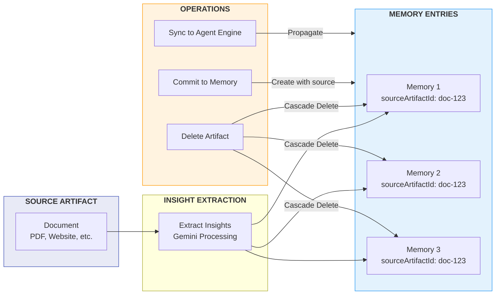
```mermaid
flowchart LR
    subgraph Source["<b>SOURCE ARTIFACT</b>"]
        DOC[Document<br/>PDF, Website, etc.]
    end

    subgraph Extraction["<b>INSIGHT EXTRACTION</b>"]
        EXT[Extract Insights<br/>Gemini Processing]
    end

    subgraph Memory["<b>MEMORY ENTRIES</b>"]
        M1[Memory 1<br/>sourceArtifactId: doc-123]
        M2[Memory 2<br/>sourceArtifactId: doc-123]
        M3[Memory 3<br/>sourceArtifactId: doc-123]
    end

    subgraph Operations["<b>OPERATIONS</b>"]
        DEL[Delete Artifact]
        COM[Commit to Memory]
        SYN[Sync to Agent Engine]
    end

    DOC --> EXT
    EXT --> M1
    EXT --> M2
    EXT --> M3

    DEL -->|"Cascade Delete"| M1
    DEL -->|"Cascade Delete"| M2
    DEL -->|"Cascade Delete"| M3

    COM -->|"Create with source"| Memory
    SYN -->|"Propagate"| Memory

    style Source fill:#e8eaf6,stroke:#3f51b5
    style Memory fill:#e3f2fd,stroke:#2196f3
    style Operations fill:#fff3e0,stroke:#ff9800
```

---

## Figure 8: Multi-Agent Search Architecture

Search sub-agent delegation pattern for grounded web search.

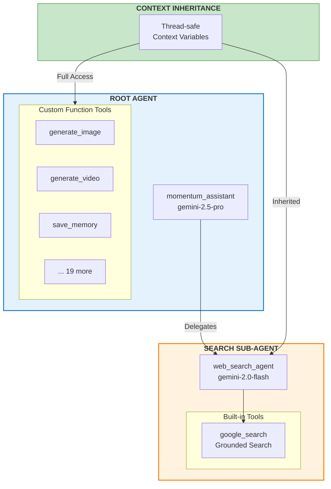
```mermaid
flowchart TB
    subgraph RootAgent["<b>ROOT AGENT</b>"]
        RA[momentum_assistant<br/>gemini-2.5-pro]

        subgraph CustomTools["Custom Function Tools"]
            GI[generate_image]
            GV[generate_video]
            SM[save_memory]
            OT[... 19 more]
        end
    end

    subgraph SearchAgent["<b>SEARCH SUB-AGENT</b>"]
        SA[web_search_agent<br/>gemini-2.0-flash]

        subgraph BuiltIn["Built-in Tools"]
            GS[google_search<br/>Grounded Search]
        end
    end

    subgraph Context["<b>CONTEXT INHERITANCE</b>"]
        CTX[Thread-safe<br/>Context Variables]
    end

    RA -->|"Delegates"| SA
    CTX -->|"Inherited"| SA
    CTX -->|"Full Access"| CustomTools
    SA --> GS

    style RootAgent fill:#e3f2fd,stroke:#1976d2,stroke-width:2px
    style SearchAgent fill:#fff3e0,stroke:#f57c00,stroke-width:2px
    style Context fill:#c8e6c9,stroke:#388e3c
```

---

## Figure 9: Evaluation Framework

Comprehensive evaluation suite architecture.

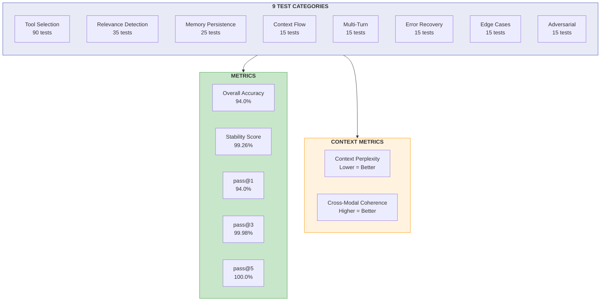
```mermaid
flowchart TB
    subgraph Categories["<b>9 TEST CATEGORIES</b>"]
        direction TB
        C1["Tool Selection<br/>90 tests"]
        C2["Relevance Detection<br/>35 tests"]
        C3["Memory Persistence<br/>25 tests"]
        C4["Context Flow<br/>15 tests"]
        C5["Multi-Turn<br/>15 tests"]
        C6["Error Recovery<br/>15 tests"]
        C7["Edge Cases<br/>15 tests"]
        C8["Adversarial<br/>15 tests"]
    end

    subgraph Metrics["<b>METRICS</b>"]
        ACC["Overall Accuracy<br/>94.0%"]
        STAB["Stability Score<br/>99.26%"]
        P1["pass@1<br/>94.0%"]
        P3["pass@3<br/>99.98%"]
        P5["pass@5<br/>100.0%"]
    end

    subgraph Context["<b>CONTEXT METRICS</b>"]
        CP["Context Perplexity<br/>Lower = Better"]
        CMC["Cross-Modal Coherence<br/>Higher = Better"]
    end

    Categories --> Metrics
    Categories --> Context

    style Categories fill:#e8eaf6,stroke:#3f51b5
    style Metrics fill:#c8e6c9,stroke:#43a047
    style Context fill:#fff3e0,stroke:#ff9800
```

### Results Summary

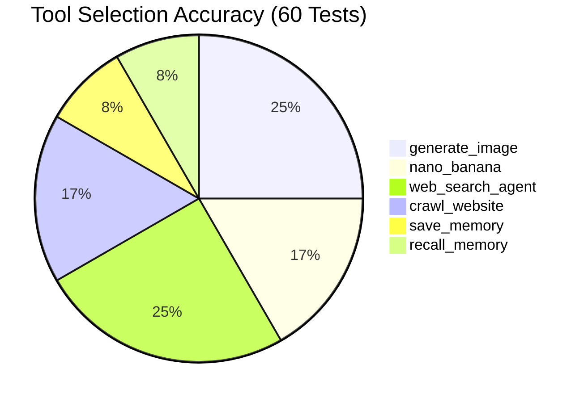
```mermaid
pie title Tool Selection Accuracy (60 Tests)
    "generate_image" : 15
    "nano_banana" : 10
    "web_search_agent" : 15
    "crawl_website" : 10
    "save_memory" : 5
    "recall_memory" : 5
```


```mermaid
xychart-beta
    title "Cross-Modal Coherence Improvement"
    x-axis ["Text→Image", "Text→Video", "Search→Text", "Image→Text"]
    y-axis "Coherence Score" 0 --> 1
    bar [0.67, 0.61, 0.73, 0.69]
    bar [0.89, 0.84, 0.91, 0.87]
```

---

## Figure 10: Case Study - Multi-Modal Campaign Generation

End-to-end workflow demonstrating context preservation.

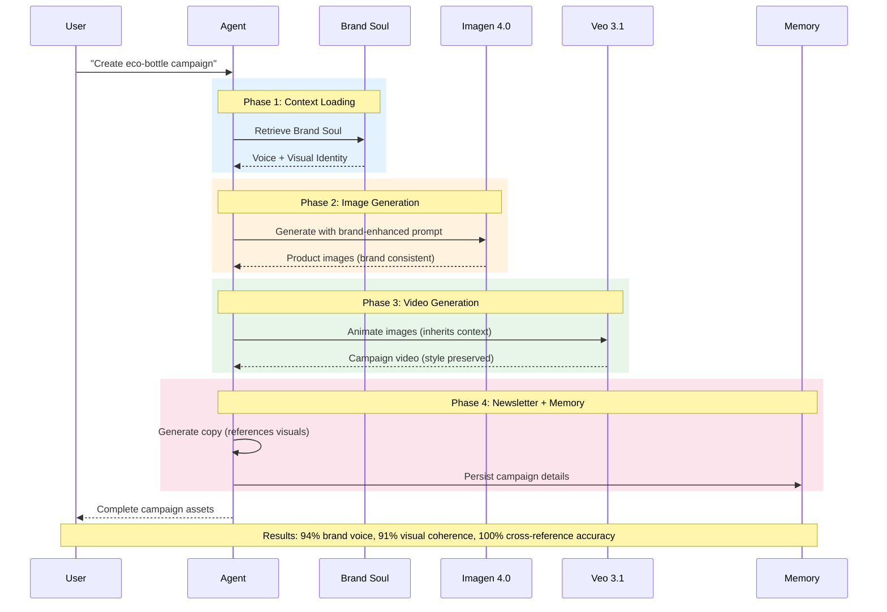
```mermaid
sequenceDiagram
    participant U as User
    participant A as Agent
    participant BS as Brand Soul
    participant I as Imagen 4.0
    participant V as Veo 3.1
    participant M as Memory

    U->>A: "Create eco-bottle campaign"

    rect rgb(227, 242, 253)
        Note over A,BS: Phase 1: Context Loading
        A->>BS: Retrieve Brand Soul
        BS-->>A: Voice + Visual Identity
    end

    rect rgb(255, 243, 224)
        Note over A,I: Phase 2: Image Generation
        A->>I: Generate with brand-enhanced prompt
        I-->>A: Product images (brand consistent)
    end

    rect rgb(232, 245, 233)
        Note over A,V: Phase 3: Video Generation
        A->>V: Animate images (inherits context)
        V-->>A: Campaign video (style preserved)
    end

    rect rgb(252, 228, 236)
        Note over A,M: Phase 4: Newsletter + Memory
        A->>A: Generate copy (references visuals)
        A->>M: Persist campaign details
    end

    A-->>U: Complete campaign assets

    Note over U,M: Results: 94% brand voice, 91% visual coherence, 100% cross-reference accuracy
```

---

## How to Render These Diagrams

### Option 1: Mermaid Live Editor
Visit [mermaid.live](https://mermaid.live) and paste any diagram code.

### Option 2: VS Code Extension
Install "Markdown Preview Mermaid Support" extension.

### Option 3: Export to PNG/SVG
Use Mermaid CLI:
```bash
npm install -g @mermaid-js/mermaid-cli
mmdc -i momentum_paper_diagrams.md -o output.png
```

### Option 4: Convert to TikZ for LaTeX
For the paper, these can be converted to TikZ diagrams or exported as high-resolution images.

---

## Image Files for Paper

To use in LaTeX, export each diagram and reference as:
```latex
\includegraphics[width=0.48\textwidth]{diagram_name.png}
```

Recommended exports:
1. `momentum_metaphor.png` - Figure 1
2. `four_layer_architecture.png` - Figure 2
3. `context_flow_sankey.png` - Figure 3
4. `brand_soul_pipeline.png` - Figure 4
5. `individual_identity_pipeline.png` - Figure 5 (NEW)
6. `visibility_workflow.png` - Figure 6 (NEW)
7. `dual_scope_memory.png` - Figure 7 (NEW)
8. `multi_agent_search.png` - Figure 8
9. `evaluation_framework.png` - Figure 9
10. `campaign_case_study.png` - Figure 10
